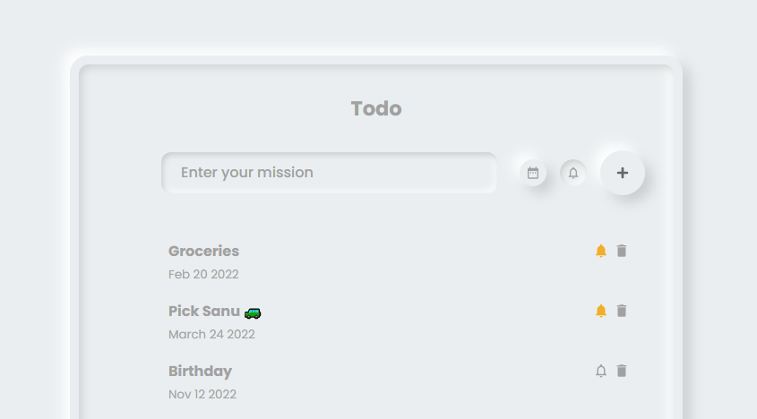

# React Todo App.

A complete todo application with all features.

**live demo: [https://ay-todo-app.netlify.app/](https://ay-todo-app.netlify.app/)**

---

### Made with ❤️ by [Akash Yadav](https://www.instagram.com/akashxolotl)

Like my works and want to support me?

<a href="https://www.buymeacoffee.com/akashyadav777" target="_blank"></a>

---

## Project Description

This is a project with Complete Todo Application with all features. We will use `React.js` Also we will learn to use fake `REST API` using `Json server`. This is a light weight friendly app designed with Neumorphism UI Concept. Hope you enjoy it.

```shell
npm install
```

and after that start the dev server.

```shell
npm start
```

## Tools Used

1. Favicon: [React Icons](https://react-icons.github.io/react-icons/)
1. Data: [Json Server](https://github.com/typicode/json-server/tree/v0)
1. Code Editor: [VS Code](https://code.visualstudio.com/)

## License

[MIT](https://choosealicense.com/licenses/mit/)

Happy Coding! 🚀